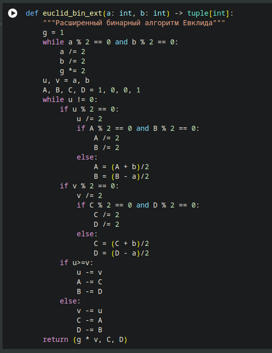

---
## Front matter
lang: ru-RU
title: Алгоритмы вычисления наибольшего общего делителя
author:
  - Андрианова М.Г.
institute:
  - Российский университет дружбы народов, Москва, Россия
date: 25 октября 2025

## i18n babel
babel-lang: russian
babel-otherlangs: english

## Formatting pdf
toc: false
toc-title: Содержание
slide_level: 2
aspectratio: 169
section-titles: true
theme: metropolis
mainfont: DejaVu Serif
romanfont: DejaVu Serif
sansfont: DejaVu Sans
monofont: DejaVu Sans Mono
header-includes:
 - \metroset{progressbar=frametitle,sectionpage=progressbar,numbering=fraction}
---

## Цель работы

Целью данной работы является реализация различных вариантов алгоритма Евклида.

## Алгоритм Евклида

```python
a, b = 12345, 54321

while a != 0 and b != 0:
  if a >= b:
    a %= b
  else:
    b %= a
return a or b
```

## Бинарный алгоритм Евклида

```python
    g = 1
    while a % 2 == 0 and b % 2 == 0:
        a /= 2 b /= 2 g *= 2
    u, v = a, b
    while u != 0:
        if u % 2 == 0: u /= 2
        if v%2 == 0: v /= 2
        if u>=v: u -= v
        else: v -= u
    return g*v
```

## Расширенный алгоритм Евклида

```python
if a == 0:
  return (b, 0, 1)
else:
  div, x, y = euclid_ext(b % a, a)
return (div, y - ( b // a ) * x, x)
```

## Расширенный бинарный алгоритм Евклида

{width=50%}


# Выводы

В данной лабораторной работе были изучены алгоритмы Евклида.

