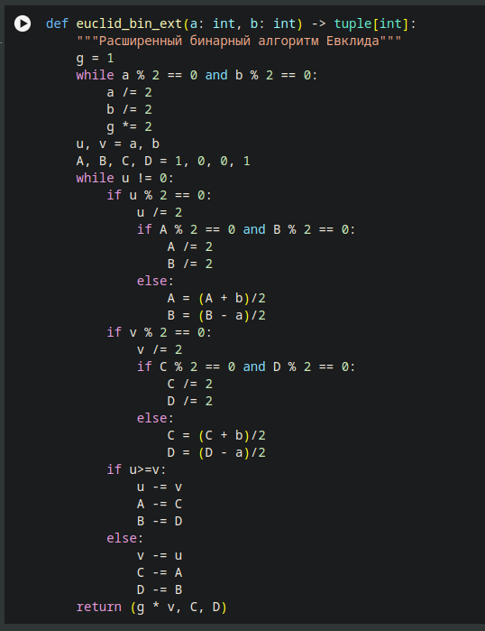

---
## Front matter
title: "Алгоритмы вычисления наибольшего общего делителя"
author: "Андрианова Марина Георгиевна"

## Generic otions
lang: ru-RU
toc-title: "Содержание"

## Bibliography
bibliography: bib/cite.bib
csl: pandoc/csl/gost-r-7-0-5-2008-numeric.csl

## Pdf output format
toc: true # Table of contents
toc-depth: 2
lof: false # List of figures
lot: false # List of tables
fontsize: 12pt
linestretch: 1.5
papersize: a4
documentclass: scrreprt
## I18n polyglossia
polyglossia-lang:
  name: russian
  options:
	- spelling=modern
	- babelshorthands=true
polyglossia-otherlangs:
  name: english
## I18n babel
babel-lang: russian
babel-otherlangs: english
## Fonts
mainfont: IBM Plex Serif
romanfont: IBM Plex Serif
sansfont: IBM Plex Sans
monofont: IBM Plex Mono
mathfont: STIX Two Math
mainfontoptions: Ligatures=Common,Ligatures=TeX,Scale=0.94
romanfontoptions: Ligatures=Common,Ligatures=TeX,Scale=0.94
sansfontoptions: Ligatures=Common,Ligatures=TeX,Scale=MatchLowercase,Scale=0.94
monofontoptions: Scale=MatchLowercase,Scale=0.94,FakeStretch=0.9
mathfontoptions:
## Biblatex
biblatex: true
biblio-style: "gost-numeric"
biblatexoptions:
  - parentracker=true
  - backend=biber
  - hyperref=auto
  - language=auto
  - autolang=other*
  - citestyle=gost-numeric
## Pandoc-crossref LaTeX customization
figureTitle: "Рис."
tableTitle: "Таблица"
listingTitle: "Листинг"
lofTitle: "Список иллюстраций"
lotTitle: "Список таблиц"
lolTitle: "Листинги"
## Misc options
indent: true
header-includes:
  - \usepackage{indentfirst}
  - \usepackage{float} # keep figures where there are in the text
  - \floatplacement{figure}{H} # keep figures where there are in the text
---

# Цель работы

Целью данной работы является реализация различных вариантов алгоритма Евклида.

# Выполнение лабораторной работы

## Алгоритм Евклида

```python
a, b = 12345, 54321

while a != 0 and b != 0:
  if a >= b:
    a %= b
  else:
    b %= a
return a or b
```


## Бинарный алгоритм Евклида

```python
    g = 1
    while a % 2 == 0 and b % 2 == 0:
        a /= 2
        b /= 2
        g *= 2
    u, v = a, b
    while u != 0:
        if u % 2 == 0:
            u /= 2
        if v%2 == 0:
            v /= 2
        if u>=v:
            u -= v
        else:
            v -= u
    return g*v
```

## Расширенный алгоритм Евклида

```python
if a == 0:
  return (b, 0, 1)
else:
  div, x, y = euclid_ext(b % a, a)
return (div, y - ( b // a ) * x, x)
```

## Расширенный бинарный алгоритм Евклида




# Выводы

В данной лабораторной работе были изучены алгоритмы Евклида.

