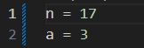
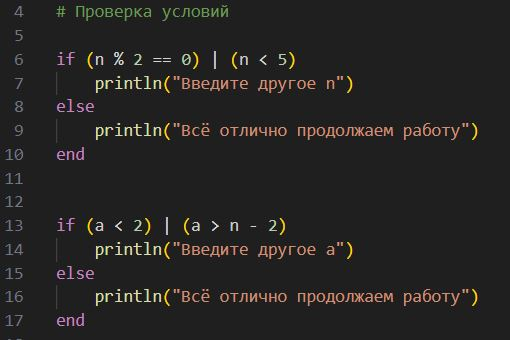
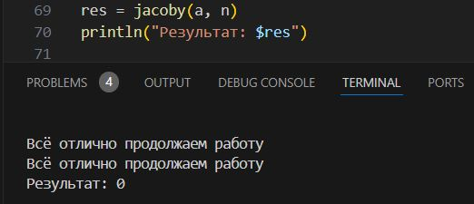
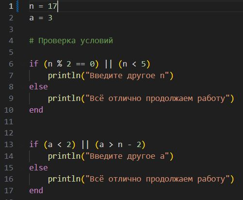
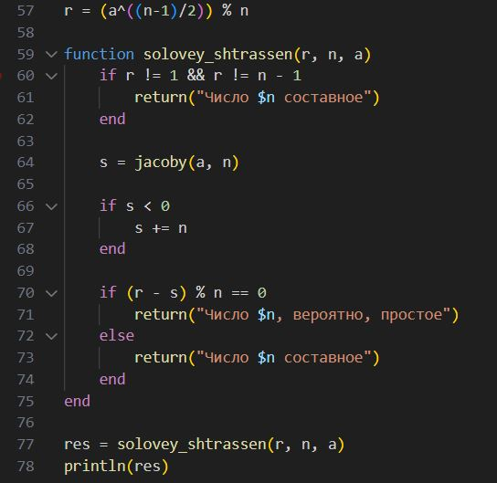

---
## Front matter
title: "Отчёт по лабораторной работе 5"
author: "Андрианова Марина Георгиевна"

## Generic otions
lang: ru-RU
toc-title: "Содержание"

## Bibliography
bibliography: bib/cite.bib
csl: pandoc/csl/gost-r-7-0-5-2008-numeric.csl

## Pdf output format
toc: true # Table of contents
toc-depth: 2
lof: true # List of figures
lot: true # List of tables
fontsize: 12pt
linestretch: 1.5
papersize: a4
documentclass: scrreprt
## I18n polyglossia
polyglossia-lang:
  name: russian
  options:
  - spelling=modern
  - babelshorthands=true
polyglossia-otherlangs:
  name: english
## I18n babel
babel-lang: russian
babel-otherlangs: english
## Fonts
mainfont: IBM Plex Serif
romanfont: IBM Plex Serif
sansfont: IBM Plex Sans
monofont: IBM Plex Mono
mathfont: STIX Two Math
mainfontoptions: Ligatures=Common,Ligatures=TeX,Scale=0.94
romanfontoptions: Ligatures=Common,Ligatures=TeX,Scale=0.94
sansfontoptions: Ligatures=Common,Ligatures=TeX,Scale=MatchLowercase,Scale=0.94
monofontoptions: Scale=MatchLowercase,Scale=0.94,FakeStretch=0.9
mathfontoptions:
## Biblatex
biblatex: true
biblio-style: "gost-numeric"
biblatexoptions:
  - parentracker=true
  - backend=biber
  - hyperref=auto
  - language=auto
  - autolang=other*
  - citestyle=gost-numeric
## Pandoc-crossref LaTeX customization
figureTitle: "Рис."
tableTitle: "Таблица"
listingTitle: "Листинг"
lofTitle: "Список иллюстраций"
lotTitle: "Список таблиц"
lolTitle: "Листинги"
## Misc options
indent: true
header-includes:
  - \usepackage{indentfirst}
  - \usepackage{float} # keep figures where there are in the text
  - \floatplacement{figure}{H} # keep figures where there are in the text
---

# Цель работы

Реализовать три вероятностных алгоритма проверки чисел на простоту и алгоритм вычисления символа Якоби.

# Задание

***Программно реализовать на языке Julia следующие алгоритмы:***

1. Алгоритм, реализующий тест Ферма
2. Алгоритм вычисления символа Якоби
3. Алгоритм, реализующий тест Соловэя-Штрассена
4. Алгоритм, реализующий тест Миллера-Рабина

# Теоретическое введение

При написании данных алгоритмов часто приходится реализовывать запись

которая в языке программирования записывается как a - b % m == 0, что означает деление без остатка.

# Выполнение лабораторной работы

## 1. Алгоритм, реализующий тест Ферма

Начинаю написание программы с ввода значений

Реализую код с проверкой данных значений, учитывая условия используемого алгоритма

По формуле Ферма реализую программный код, вычисляя значение r и проверяя его для получения результата

Выполняю программу и получаю результат

## 2. Алгоритм вычисления символа Якоби

Аналогично предыдущей программе начинаю с ввода значений и проверки правильности введенных значений, учитывая условие задачи

Для того, чтобы реализовать алгоритм, необходимо представить число a, как произведение простого числа на 2 в k-ой степени.
Для этого создаю отдельную функцию

Создаю алгоритм вычисления символа Якоби, использую функцию, написанную ранее, и правила создания, указанные в документе с заданием

Выполняю программу и получаю результат

## 3. Алгоритм, реализующий тест Соловэя-Штрассена

Аналогично предыдущей программе начинаю с ввода значений и проверки правильности введенных значений, учитывая условие задачи

В данной задаче необходимо найти символ Якоби, его я искала при помощи функции, реализованной ранее.
По формуле Соловэя-Штрассена вычисляю r и при помощи функции для символа Якоби реализую данный алгоритм

Выполняю программу и получаю результат

## 4. Алгоритм, реализующий тест Миллера-Рабина

Аналогично предыдущей программе начинаю с ввода значений и проверки правильности введенных значений, учитывая условие задачи

В данной задаче использую функцию, написанную в алгоритме для символа Якоби, чтобы представить число в виде произведения некоторого нечетного числа на 2 в степени k.
В остальном использую формулы для вычисления Миллера-Рабина, пишу следующий код

Выполняю программу и получаю результат

# Выводы

В процессе выполнения работы я реализовала разные виды вероятностных алгоритмов проверки чисел на простоту на языке программирования Julia.